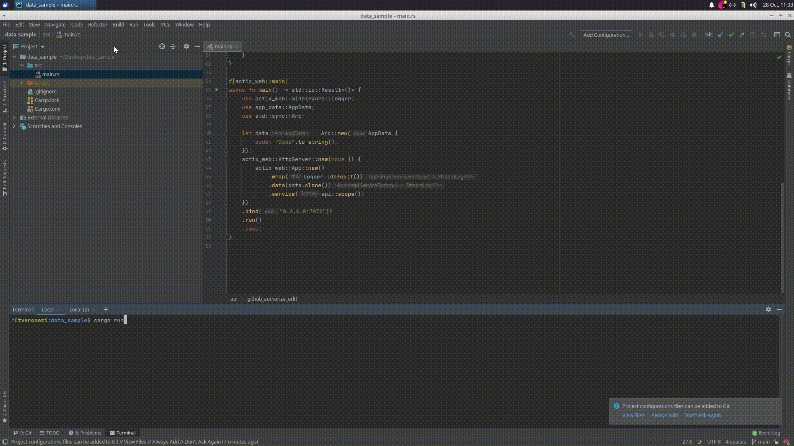

# App data is not configured, to configure use App::data()

This application throws this `App data is not configured, to configure use App::data()` message 
when I try to use data. What am I doing wrong here? Tx!

This fixes the issue: https://github.com/tveronezi/data_sample/pull/1

Thanks for your help! https://gitter.im/actix/actix?at=5f999341b4283c208a2e6489